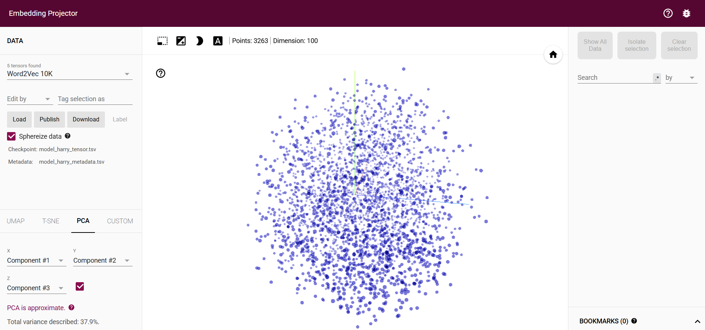
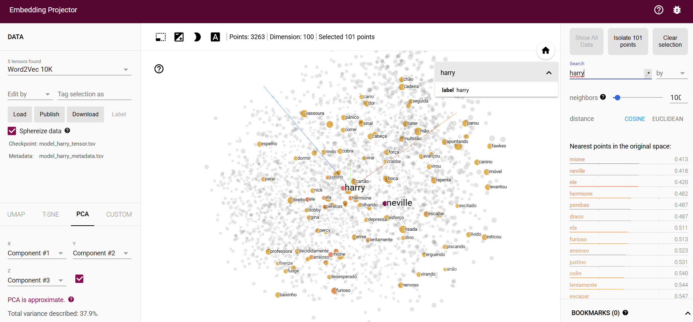
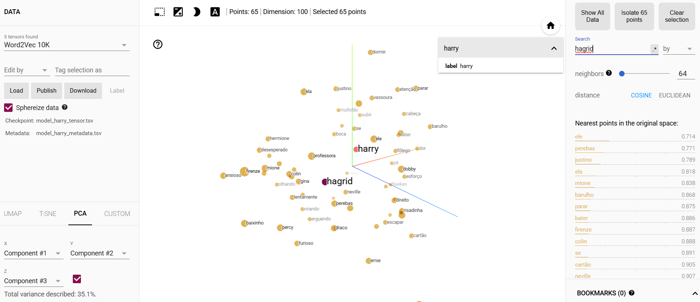

# Aula 10 - Word2Vec com Gensim

Este notebook demonstra a utilização do modelo **Word2Vec** da biblioteca **Gensim** para criar e explorar embeddings de palavras. O exemplo inclui desde um caso básico até a aplicação em textos mais complexos, como os livros do Harry Potter em português.

## Objetivos
- Aprender a criar e treinar um modelo Word2Vec.
- Explorar relações semânticas entre palavras usando embeddings.
- Aplicar o modelo a textos reais (livros do Harry Potter).

## Conteúdo do Notebook
1. **Exemplo Básico de Word2Vec**:
   - Treinamento de um modelo com frases simples.
   - Visualização do vetor de embedding para a palavra "sentence".

2. **Aplicação em Textos Reais**:
   - Pré-processamento de dois livros do Harry Potter em português:
     - `Harry_Potter_Camara_Secreta-br.txt`
     - `Harry_Potter_e_A_Pedra_Filosofal.txt`
   - Tokenização e criação de uma lista de listas de tokens para treinar o modelo.

3. **Exploração do Modelo**:
   - Encontrar palavras similares a "harry".
   - Calcular similaridades entre pares de palavras (ex: "harry" e "hagrid").
   - Identificar a palavra que não pertence a um conjunto (ex: "harry", "dobby", "hagrid").
   - Exportar os embeddings para visualização no [TensorFlow Projector](https://projector.tensorflow.org).

## Como Usar
1. **Pré-requisitos**:
   - Instalar as bibliotecas necessárias:
     ```bash
     pip install gensim
     ```
   - Certifiquar-nos de que os arquivos de texto (`Harry_Potter_*.txt`) estão no mesma diretoria do notebook.

2. **Execução**:
   - Executar as células sequencialmente para treinar o modelo e explorar os resultados.
   - Para visualizar os embeddings no TensorFlow Projector:
     - Exportar os vetores:
       ```python
       model.wv.save_word2vec_format('model_harry.txt', binary=False)
       ```
     - Converter o arquivo para o formato do TensorFlow:
       ```bash
       python -m gensim.scripts.word2vec2tensor --input model_harry.txt --output model_harry
       ```
     - Carreguar o resultado no [TensorFlow Projector](https://projector.tensorflow.org).
     
        *Resultado do upload dos ficheiros obtidos para análise.*

## Resultados Esperados
- Palavras relacionadas a "harry" (como "neville", "hermione") devem ter alta similaridade.

- A comparação entre pares de personagens (ex: "harry" e "hagrid") mostrará valores de similaridade próximos de 0.5, indicando relações moderadas.

- A palavra "dobby" será identificada como a menos relacionada no conjunto ["harry", "dobby", "hagrid"].


## Observações
- O modelo foi treinado com `vector_size=100` e `epochs=20`, mas podemos ajustar esses parâmetros para melhorar os resultados.
- O pré-processamento é simples (tokenização em minúsculas), mas pode ser estendido com técnicas como remoção de stopwords ou lematização.
